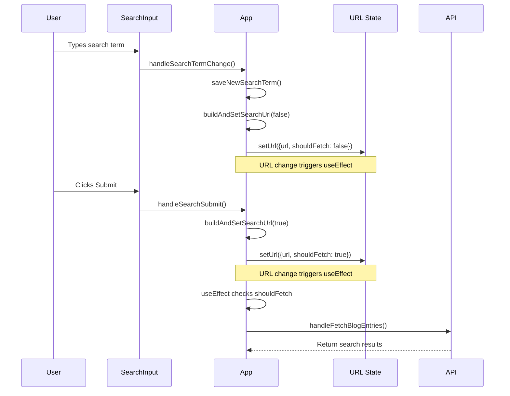

# Sequence Diagram: Search Form v1.4.0

```mermaid
sequenceDiagram
    participant User
    participant SearchInput
    participant App
    participant URL State
    participant API

    User->>SearchInput: Types search term
    SearchInput->>App: handleSearchTermChange()
    App->>App: saveNewSearchTerm()
    App->>App: buildAndSetSearchUrl(false)
    App->>URL State: setUrl({url, shouldFetch: false})
    
    Note over App,URL State: URL change triggers useEffect
    
    User->>SearchInput: Clicks Submit
    SearchInput->>App: handleSearchSubmit()
    App->>App: buildAndSetSearchUrl(true)
    App->>URL State: setUrl({url, shouldFetch: true})
    
    Note over App,URL State: URL change triggers useEffect
    
    App->>App: useEffect checks shouldFetch
    App->>API: handleFetchBlogEntries()
    API-->>App: Return search results
```
