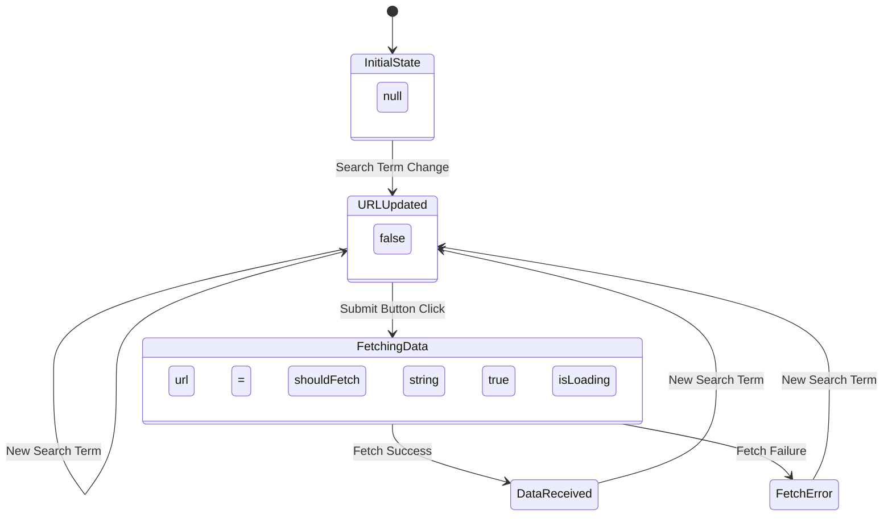

# State Diagram: Search Form v1.4.0
  

```mermaid
stateDiagram-v2
[*] --> InitialState
InitialState --> URLUpdated: Search Term Change
URLUpdated --> URLUpdated: New Search Term
URLUpdated --> FetchingData: Submit Button Click
FetchingData --> DataReceived: Fetch Success
FetchingData --> FetchError: Fetch Failure
DataReceived --> URLUpdated: New Search Term
FetchError --> URLUpdated: New Search Term

state InitialState {
    url = null
    shouldFetch = false
}

state URLUpdated {
    url = string
    shouldFetch = false
}

state FetchingData {
    url = string
    shouldFetch = true
    isLoading = true
}
```
